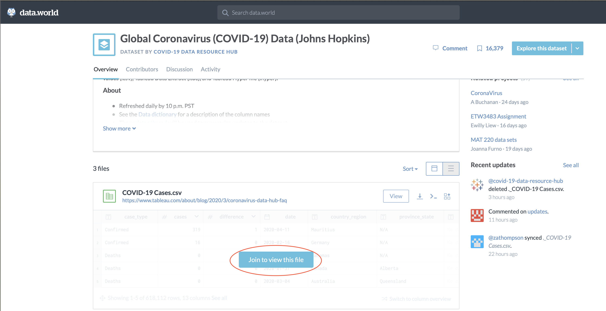
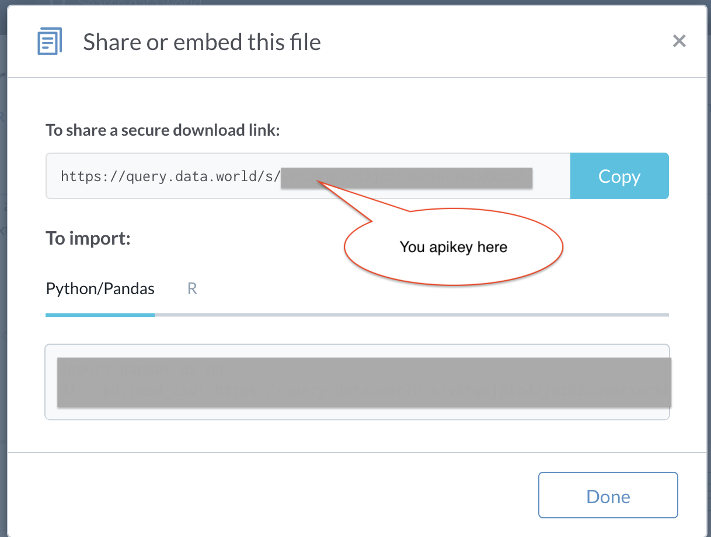
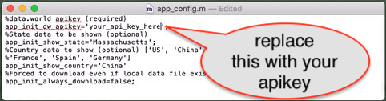
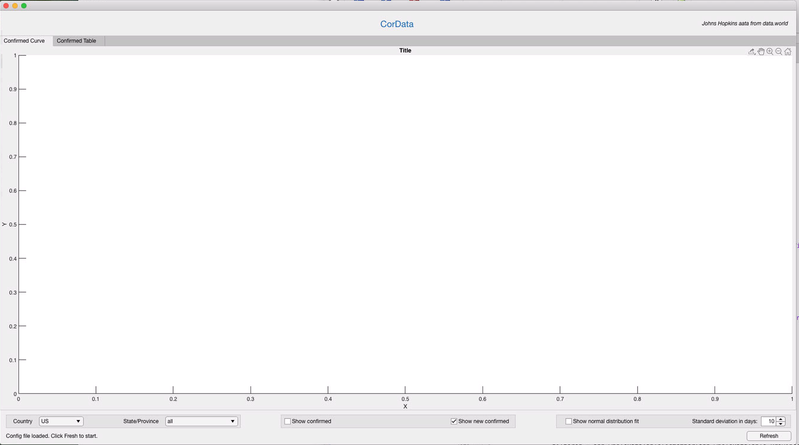
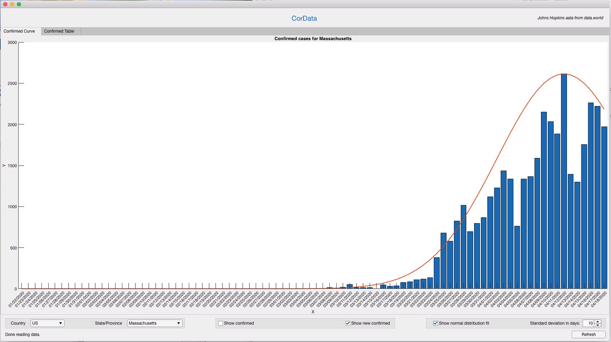

# CorData
This is a MatLab App that fetches corona-19 data from [data.world](https://data.world/covid-19-data-resource-hub/covid-19-case-counts) (Johns Hopkins data). 

## Component
A MatLab [app file](CorData.mlapp) and a [config](app_config.m) file. Pull these two files to a folder.

The config file contains configuration data for tuning the App.

## Usage
Before you can use this App the first time, you need to edit the 
### Config file
There is a one-time setup step to get a free api key from data.world.
Get a free data.world apikey first. Goto [data.work](https://data.world/covid-19-data-resource-hub/covid-19-case-counts).

Click "Join to view this file". 
Select one way to join data.world from the popped up dialog. 

Once you can sign, you get a free apikey. 

Go back the same [page](https://data.world/covid-19-data-resource-hub/covid-19-case-counts), click the download button for the "COVID-19 Cases.csv" file. Select "Share URL", your apikey will be shown:

Now use an text editor to edit app_config.m and put your apikey there.

### Start
Just open CorData.mlapp from MatLab. Make sure you change your working directory to the folder of CorData.mlapp so MatLab can find the app_config.m file.

Click "Refresh" to start download data and show. Note it takes a while to download the csv file and process the data.

Note that the checkbox of "show normal distribution fit" has been checked to show the red line. It tries to fit the curve into a normal distribution. Adjust the standard deviation to see different result.

Also select other country/state to view other data.

## Summary
The whole app contains only ~250 lines handwritten code. This shows strong support from MatLab that can greatly simplify the development job.
 

