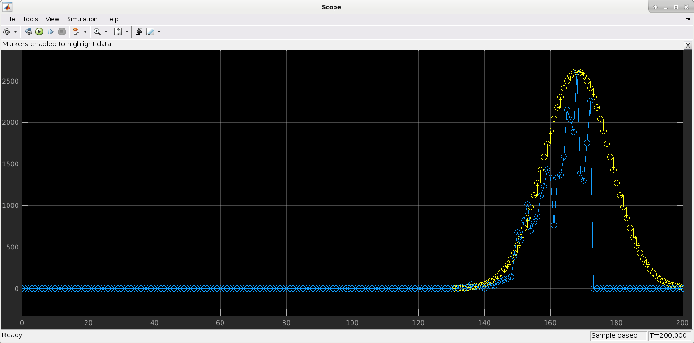
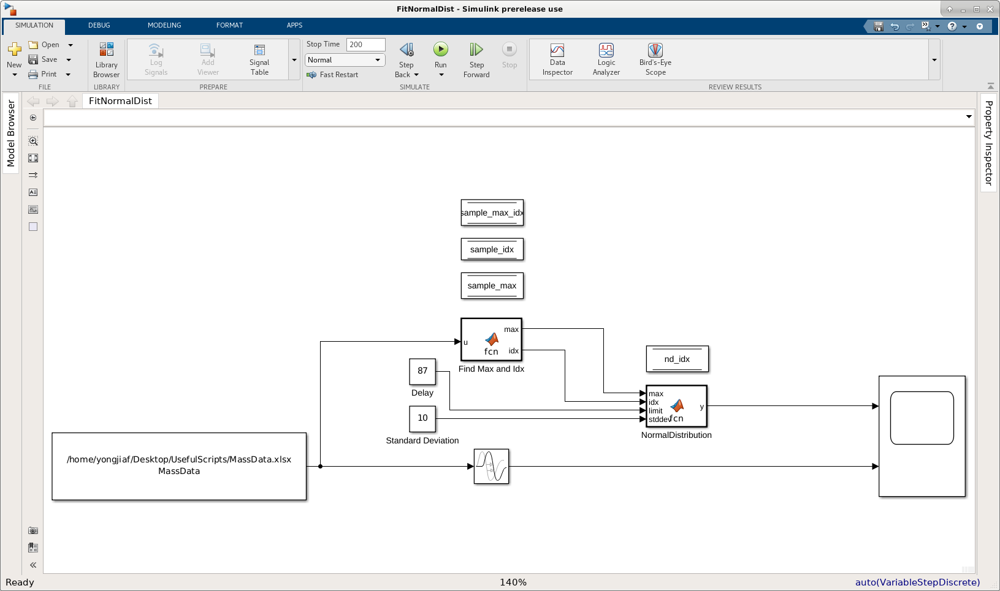

#SlFitNormDist
This is a MatLab Simulink model that plots Corona data from a csv file, and fits it to a normal distribution. 

The Simulink model contains
* a node to read data from a csv file
* a node to compute the max
* a node to delay the input signal (so max can be computed)
* a node to compute the normal distribution fit
* a node to show the plots
 
